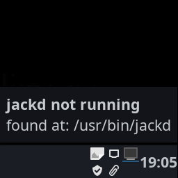
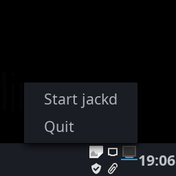
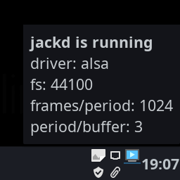

# jackd_status

Simple XFCE4 status notifier for the jack audio daemon

You can also start and stop jackd via a menu option

## Usage

In order to be able to start jackd, you need to create the 
file `~/.jackd_cmd.txt` and add to it your preferred jackd 
startup command. For example:

```bash
$ echo "/usr/bin/jackd -P70 -d alsa -r 44100 -p1024 -n4 &" > ~/.jackd_cmd.txt

```


### Install External Dependencies:

```bash
$ sudo pacman -S jack2 # Or similar
```

### Download and Install:

```bash
$ pip install --user git+https://github.com/cbrown1/jackd_status.git#egg=jackd_status
```

If you want jackd_status to run on startup, you could do something like:

```bash
echo "[Desktop Entry]
Name=Jackd_status
Comment=jackd StatusIcon for XFCE4
Exec=jackd_status
Icon=state_running
Type=Application
Categories=Audio;
StartupNotify=true" > jackd_status.desktop

cp jackd_status.desktop ~/.config/autostart # Adds to autostart
mkdir -p ~/.local/share/applications
mv jackd_status.desktop ~/.local/share/applications # Adds a menu item to the Multimedia group
```


## Usage

Just type the command jackd_status

```bash
$ jackd_status

```

## Screenshots

### You'll see a monitor icon that is off when jack is not running



### Click the icon and you will get a menu item to start jackd



### When jackd is running, the monitor screen changes




## Notes

- Why not [qjackctl](https://sourceforge.net/projects/qjackctl/)? It's great, but this is lighter and simpler.


## Authors

- [**Christopher Brown**](https://github.com/cbrown1)


## License

This project is licensed under the GPLv3 - see the [LICENSE.md](LICENSE.md) file for details.
